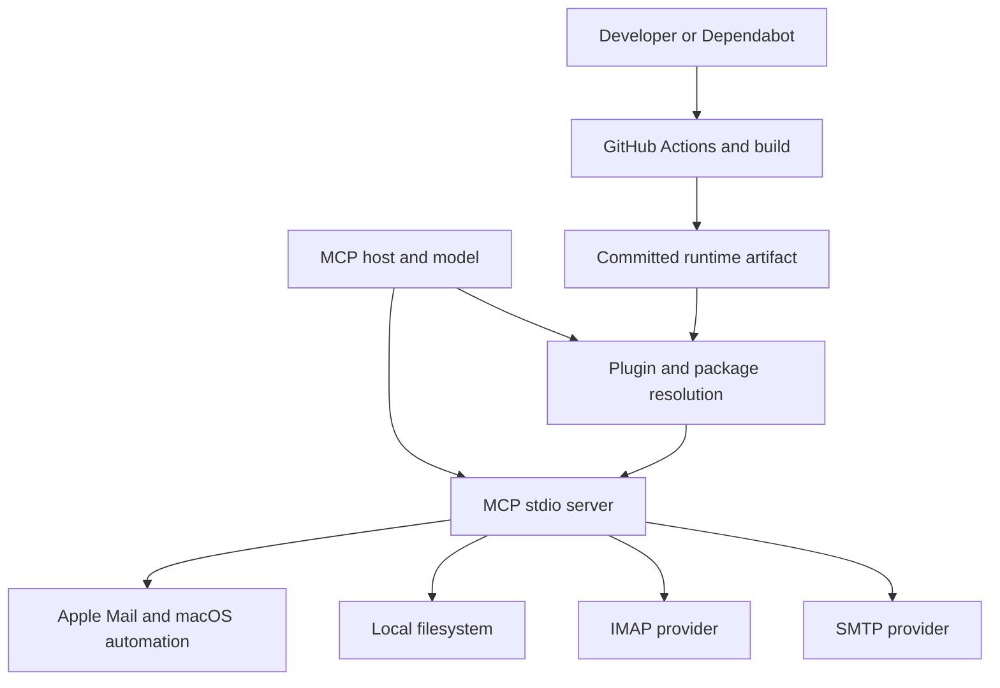

# Apple Mail MCP Threat Model

## Executive summary

This repository is a macOS TypeScript MCP server with authority to read and mutate Apple Mail, send through Mail.app or optional SMTP, access optional IMAP accounts, read local attachment paths, write inbound attachments, and create persistent Mail rules. The highest-risk abuse paths are confused-deputy flows: a hostile email or misled model can turn a broad file path into outbound exfiltration, a numeric Mail id into a wrong-message mutation, or one enabled rule into durable deletion or movement. Existing escaping, path-prefix, mailbox-scoping, forensic, schema, and attachment-size controls are meaningful, but several privileged boundaries still rely on prose, mutable defaults, or broad filesystem and network authority.

## Scope and assumptions

- In scope: runtime behavior under `src/`, the committed `build/` artifact, plugin launch configuration under `codex/`, package and lockfile state, security policy, and Dependabot workflows.
- Out of scope: Apple Mail, Contacts, macOS TCC, the user's Keychain, IMAP/SMTP servers, the MCP host's implementation, and any remote bridge that may expose this stdio process. Those systems are modeled as external boundaries, not as repository code.
- Intended use: an MCP server used to control personal or organizational Apple Mail from an AI host.
- Native deployment: the repository starts a stdio MCP transport and supplies no authentication, tenant isolation, or authorization layer. Any host or wrapper that exposes it to remote or multi-user clients must provide authentication and authorization before forwarding calls.
- Optional services: SMTP and IMAP are inert until configured (`~/Library/Application Support/apple-mail-mcp/config.json` plus Keychain credentials). Every tool is registered unconditionally at startup, including the Contacts, smart-mailbox and filesystem-attachment tools — those are gated by macOS TCC and the filesystem boundary at call time, not by registration. The default AppleScript mail path is local to the Mac, but it still has the Mail.app authority granted by macOS TCC.
- Attachment writes: `save-attachment` is constrained to the home directory, `/tmp`, `/private/tmp`, and `/Volumes`; canonicalization, path-segment checks, traversal rejection, symlink checks, and exclusive creation protect the destination boundary.
- Data sensitivity: mailbox contents, attachment bytes, contact data, message metadata, credentials obtained through the macOS Keychain, SMTP/IMAP traffic, and local files reachable by attachment paths are sensitive.
- Attacker assumption: an attacker can influence email content, attachment names and bytes, prompt context, or a connected model's tool arguments, but cannot directly edit the local repository or invoke macOS APIs outside the MCP unless the host grants that path.

The ranking below treats hostile mail, prompt injection, and unsafe tool arguments as in scope. It treats remote exposure as conditional on a wrapper: the repository does not claim to secure a wrapper that it does not implement.

## System model

### Primary components

- `src/index.ts` is the MCP entrypoint. It registers tool schemas and handlers, routes numeric ids to AppleScript and `imap:` ids to IMAP, and starts `StdioServerTransport`.
- `src/services/appleMailManager.ts` is the AppleScript authority for account discovery, message reads and mutations, attachments, rules, contacts, and smart-mailbox operations. It executes `osascript` through `src/utils/applescript.ts`.
- `src/services/imapClient.ts` is the optional IMAP authority. It resolves credentials from environment or Keychain, maintains pooled connections, reads messages and attachments, and performs server-side mutations.
- `src/services/smtpMailer.ts` is the optional outbound network authority. It resolves SMTP credentials and sends MIME through Nodemailer.
- `src/utils/attachmentMaterialize.ts` and the attachment builders in `appleMailManager.ts` and `smtpMailer.ts` turn tool arguments into local file reads or temporary files.
- `codex/.mcp.json` and the plugin manifests define how a host starts the server. The Codex manifest pins an exact `apple-mail-mcp` version (#166) and `scripts/sync-plugin-version.mjs` rewrites that pin on every bump, but npm resolution still carries no integrity/hash binding.
- `.github/workflows/dependabot-automerge.yml` and `.github/workflows/dependabot-rebuild.yml` govern automated dependency changes and committed bundle regeneration. They are CI/build surfaces, not runtime controls.

### Data flows and trust boundaries

- MCP host -> `src/index.ts`: tool arguments, ids, mailbox names, recipient addresses, rule definitions, attachment paths, and base64 bytes cross a local stdio boundary. Zod schemas validate many shapes and sizes; there is no authentication or per-caller authorization in the repository.
- `src/index.ts` -> `appleMailManager.ts`: validated arguments cross an in-process boundary into AppleScript generation. Numeric values are coerced and many strings are escaped; authorization is mostly tool semantics and descriptions rather than a capability gate.
- `appleMailManager.ts` -> macOS Mail.app: Apple Events and `osascript` cross a privileged automation boundary. macOS TCC controls whether the process may automate Mail, but the repository does not distinguish callers or restrict which authenticated user may invoke a tool.
- MCP host -> local filesystem attachment readers: attachment paths are canonicalized and must be regular files inside the default user-content/temporary roots or an explicit configured root; symlink escapes are rejected before Mail.app or Nodemailer reads them.
- Mail.app or IMAP -> local filesystem attachment writers: email-controlled filenames and bytes cross into `saveAttachment` or the IMAP save handler. Save roots and traversal/symlink checks exist, and existing destinations are rejected by exclusive creation.
- `src/index.ts` -> `imapClient.ts` -> IMAP server: account labels, mailbox paths, UIDs, searches, attachment sections, and mutations cross an authenticated TLS boundary. IMAP ids encode account, path, and UID; attachment buffering remains a separate availability concern.
- `src/index.ts` -> `smtpMailer.ts` -> SMTP server: recipient data, message content, local attachment paths, and Keychain-backed credentials cross an outbound network boundary. Non-implicit-TLS SMTP requires STARTTLS.
- Developer or Dependabot PR -> GitHub Actions -> committed `build/`: dependency-selected code is installed and built in CI. The rebuild workflow recognizes that toolchain dependencies can alter shipped bytes, while the automerge workflow still treats every direct development dependency as safe to merge automatically.
- Plugin install -> npm registry -> launched server: `codex/.mcp.json` invokes `npx -y apple-mail-mcp@<exact-version>` (pinned by #166, kept in sync by CI). The version is no longer a separate trust claim, but npm resolution still has no integrity/hash binding, so a registry compromise could serve different bytes for that same version.

#### Diagram

## Assets and security objectives

| Asset                                              | Why it matters                                                                     | Security objective (C/I/A) |
| -------------------------------------------------- | ---------------------------------------------------------------------------------- | -------------------------- |
| Mailbox contents and attachment bytes              | Personal, business, and potentially regulated communications                       | C/I                        |
| Send authority and recipient lists                 | Misuse can create irreversible external communications or data leaks               | I                          |
| SMTP and IMAP credentials                          | Keychain-backed credentials grant network mailbox access                           | C/I                        |
| Local files exposed as attachments                 | Home-directory files may contain tokens, keys, browser data, and private records   | C                          |
| Inbound attachment destination files               | Overwrite can corrupt configuration, shell startup, or user data                   | I/A                        |
| Persistent Mail rules                              | A rule can continue deleting or moving mail after the initiating conversation ends | I/A                        |
| Mailbox placement and message identity             | A wrong numeric-id target can silently mutate a different copy                     | I                          |
| Committed `build/` and plugin launch configuration | These determine the bytes and authority users execute                              | I                          |
| MCP server availability and memory                 | Large attachment downloads or queued operations can starve the local agent         | A                          |
| Audit and error records                            | Forensics must remain trustworthy during destructive operations                    | I                          |

## Attacker model

### Capabilities

- Supply or influence email subjects, bodies, attachment filenames, attachment bytes, and message metadata through a provider or a sender.
- Influence an AI model or MCP client through prompt injection, misleading mailbox content, or ambiguous natural-language requests so it emits valid but unsafe tool arguments.
- Reach the MCP through the configured host boundary. Under the selected broader-exposure assumption, this may include a remote or multi-user wrapper unless that wrapper adds authentication and authorization.
- Trigger valid paths, mailbox names, numeric ids, `imap:` ids, rule definitions, and network configuration values that the repository accepts.
- Cause large or repeated reads and attachment fetches within the limits the host imposes.

### Non-capabilities

- Direct repository write access, GitHub maintainer privileges, or the ability to change a committed workflow are not assumed for a runtime attacker.
- Direct Keychain extraction, Mail.app automation, or arbitrary local file access outside the server's granted process authority is not assumed; these are consequences to protect, not attacker prerequisites.
- A remote client is not considered authenticated merely because it can reach a wrapper. If the wrapper has no identity and authorization layer, that is an exposure assumption and a separate deployment defect.

## Entry points and attack surfaces

| Surface                   | How reached                                        | Trust boundary                           | Notes                                                                                     | Evidence (repo path / symbol)                                                              |
| ------------------------- | -------------------------------------------------- | ---------------------------------------- | ----------------------------------------------------------------------------------------- | ------------------------------------------------------------------------------------------ |
| Tool arguments            | MCP `tools/call` over stdio or a host wrapper      | Host to runtime                          | Schemas validate shape but not caller authority                                           | `src/index.ts` `registerTool`                                                              |
| Numeric message mutations | `delete-message`, `move-message`, six batch tools  | Runtime to Mail.app                      | Numeric ids are mailbox-local; some paths still walk first match                          | `src/services/appleMailManager.ts` `replyToMessage`, `forwardMessage`, `findMessageScript` |
| Attachment path input     | `send-email`, `create-draft`, CLI attachment flags | Runtime to local files and SMTP/Mail.app | Absolute and existing is not a confidentiality boundary                                   | `src/index.ts` `ATTACHMENTS_SCHEMA`, `src/services/smtpMailer.ts` `buildAttachments`       |
| Attachment save           | `save-attachment`                                  | Mail/IMAP to local filesystem            | Traversal and final symlink checks exist; regular overwrite is not rejected               | `resolveAttachmentSaveTarget`, `saveAttachment`                                            |
| IMAP attachment fetch     | `fetch-attachment`, IMAP save path                 | IMAP provider to process memory          | buffering is capped by `MAX_IMAP_ATTACHMENT_BYTES`; oversize parts are refused mid-stream | `src/services/imapClient.ts` `streamToBuffer`, `imapFetchAttachment`                       |
| Persistent rules          | `create-rule`                                      | MCP to durable Mail.app automation       | Default enabled state can make delete/move persistent                                     | `src/index.ts` `create-rule`, `AppleMailManager.createRule`                                |
| Network credentials       | SMTP/IMAP configuration and Keychain reads         | Runtime to providers                     | TLS mode is not uniformly fail-closed                                                     | `src/services/smtpMailer.ts`, `src/services/imapClient.ts`                                 |
| Runtime supply chain      | Plugin install and MCP start                       | Registry/plugin to executable            | `npx` resolves a pinned version with no integrity binding                                 | `codex/.mcp.json`                                                                          |
| CI artifact promotion     | Dependabot PRs and workflow pushes                 | Developer intent to shipped build        | Dev toolchain changes can alter `build/`                                                  | `.github/workflows/dependabot-automerge.yml`, `dependabot-rebuild.yml`                     |

## Top abuse paths

1. **Exfiltrate a local secret:** a malicious message or prompt convinces the model to attach an absolute path under the home directory -> the outbound builder reads it -> SMTP or Mail.app sends it to an attacker-controlled recipient.
2. **Corrupt a local file:** an attacker controls an inbound attachment filename and convinces the model to save it to a permitted directory -> the regular destination exists -> `writeFileSync` or Mail.app save replaces it.
3. **Mutate the wrong message:** a numeric id is duplicated across mailboxes or accounts -> reply, forward, or an implicitly account-resolved batch chooses the first/default match -> the server reports success for a different message.
4. **Install durable deletion:** a prompt injection supplies a valid `create-rule` request with `delete` or `moveTo` -> the rule is created enabled -> future mail is changed after the initiating conversation is over.
5. **Turn delete into purge:** an IMAP `delete-message` request names a message already in Trash -> the implementation calls `messageDelete` -> the message is permanently expunged despite the recoverable-delete contract.
6. **Exhaust the MCP process:** a provider advertises or streams a very large attachment -> `streamToBuffer` refuses the part once the running total exceeds `MAX_IMAP_ATTACHMENT_BYTES`, so the concatenated buffer and base64 representation are never allocated. Closed by #162.
7. **Expose credentials or mail:** a non-implicit-TLS SMTP or IMAP endpoint does not offer STARTTLS -> the client proceeds or relies on opportunistic behavior -> credentials or content can cross the network without the intended encryption guarantee.
8. **Run unreviewed code:** a plugin install starts `npx -y apple-mail-mcp` -> registry resolution selects a newer or compromised package than the manifest version -> the launched process inherits the host's Mail, filesystem, and network authority.

## Threat model table

| Threat ID | Threat source                                | Prerequisites                                                                     | Threat action                                                      | Impact                                                                   | Impacted assets                                      | Existing controls (evidence)                                                                                     | Gaps                                                                                                        | Recommended mitigations                                                                                                                                                 | Detection ideas                                                                                       | Likelihood                  | Impact severity | Priority    |
| --------- | -------------------------------------------- | --------------------------------------------------------------------------------- | ------------------------------------------------------------------ | ------------------------------------------------------------------------ | ---------------------------------------------------- | ---------------------------------------------------------------------------------------------------------------- | ----------------------------------------------------------------------------------------------------------- | ----------------------------------------------------------------------------------------------------------------------------------------------------------------------- | ----------------------------------------------------------------------------------------------------- | --------------------------- | --------------- | ----------- |
| TM-001    | Malicious email or misled model              | Outbound attachments enabled; model can choose a path and recipient               | Read an arbitrary existing local path and send it as an attachment | Direct local-file exfiltration                                           | Local files, mailbox data, send authority            | Absolute/existing checks in `src/services/smtpMailer.ts`; inline base64 limit in `src/utils/attachmentLimits.ts` | No narrow read-root policy or enforced approval gate                                                        | Allow only configured dedicated read roots; resolve real paths and reject symlink escapes; require an explicit send capability and recipient confirmation outside prose | Audit attachment canonical path, recipient, transport, and rejection reason; alert on sensitive roots | high under broader exposure | high            | critical    |
| TM-002    | Malicious sender or misled model             | Inbound attachment save enabled; destination already exists                       | Replace a regular file through AppleScript or IMAP save            | Local data/config corruption and possible code or shell behavior changes | Destination files, availability, integrity           | Allowed-root, traversal, and final symlink checks in `resolveAttachmentSaveTarget`                               | Existing regular files are accepted; IMAP path uses normal `writeFileSync`                                  | Dedicated save root plus exclusive no-overwrite creation for both backends; reject all existing destinations                                                            | Log canonical destination, inode/type, and exclusive-create failure                                   | high                        | high            | high        |
| TM-003    | Malicious email or ambiguous client          | Numeric id appears in multiple mailboxes/accounts or source mailbox lacks account | Reply, forward, or batch-mutate the first/default match            | Wrong-message disclosure or integrity mutation                           | Mailbox contents, send authority, message placement  | `findMessageScript` has scoped and ambiguity-refusing logic; batch source fields exist; id schema limits syntax  | `replyToMessage` and `forwardMessage` still walk first match; lone `sourceMailbox` resolves default account | Route every numeric mutation through the shared resolver; require atomic account+mailbox scope; support stable IMAP identity for reply/forward                          | Record account/mailbox and RFC Message-ID before mutation; refuse multiple hits                       | high                        | high            | critical    |
| TM-004    | Prompt injection or compromised client       | Caller can invoke `create-rule` with delete/move action                           | Create an enabled persistent rule in one call                      | Durable autonomous deletion or movement                                  | Persistent rules, mailbox integrity and availability | Tool description asks for confirmation; `disable-rule` and `enable-rule` exist                                   | Confirmation is not enforced; schema and manager default `enabled:true`                                     | Default new rules disabled; require separate explicit enable operation and capability for destructive rule actions                                                      | Alert on rule creation, action type, enabled state, and actor identity                                | medium-high                 | high            | high        |
| TM-005    | Misled client or destructive workflow        | IMAP id points to Trash and delete tool is available                              | Treat recoverable delete as expunge                                | Permanent mail loss                                                      | Mailbox contents and integrity                       | Non-Trash IMAP deletes move to provider Trash in `trashUids`                                                     | Already-Trash branch calls `messageDelete` and reports permanent deletion                                   | Make `delete-message` refuse already-trashed items; add a separate, explicit purge capability only if needed                                                            | Alert on attempted purge and record no-op refusal                                                     | medium                      | high            | high        |
| TM-006    | Malicious provider or large-message sender   | IMAP attachment fetch is enabled                                                  | Stream an oversized part to the process                            | Memory exhaustion or service denial                                      | Server availability and mailbox responsiveness       | Inline attachment ceiling protects only outbound base64 in `attachmentLimits.ts`                                 | Closed by #162 — `streamToBuffer` takes an explicit `maxBytes` and throws before the buffer grows past it   | Check BODYSTRUCTURE size before download and enforce a streamed byte cap; abort and fail closed                                                                         | Record declared and observed bytes, account, mailbox, and limit breach                                | medium                      | medium-high     | medium-high |
| TM-007    | Network attacker or misconfigured provider   | SMTP/IMAP configured without implicit TLS; endpoint can omit STARTTLS             | Cause or exploit plaintext continuation                            | Credential and message disclosure or active tampering                    | Credentials, mail contents, send authority           | SMTP has `secure`; IMAP uses `secure: port === 993`; Node/provider defaults may upgrade opportunistically        | STARTTLS is not required explicitly                                                                         | Set SMTP `requireTLS:true` when not implicit TLS; set ImapFlow `doSTARTTLS:true`; reject unsupported insecure modes                                                     | Log negotiated security mode without secrets; fail health checks when TLS cannot be guaranteed        | low-medium                  | high            | medium-high |
| TM-008    | Registry compromise or mutable package drift | Plugin installation uses npm resolution                                           | Start a package different from the reviewed manifest               | Full local process authority runs unreviewed code                        | Build/runtime integrity, Mail, files, credentials    | Plugin manifest has a version; package build is committed                                                        | `codex/.mcp.json` is exact-pinned (#166); npm resolution still has no integrity/hash binding                | Exact version pinned (#166); remaining option is execute a vendored committed artifact with integrity verification                                                      | Record resolved package version and hash at install/start; verify against manifest                    | medium                      | high            | high        |
| TM-009    | Supply-chain change or workflow mistake      | Dependabot PR changes a direct dev dependency or generated build                  | Auto-merge a toolchain change that alters committed `build/`       | Unreviewed shipped behavior or malicious artifact promotion              | Build artifact, runtime integrity                    | Rebuild workflow explicitly recognizes esbuild/typescript drift and pins action SHAs                             | Automerge treats all direct development dependencies as safe                                                | Require human review for npm dependency PRs that can affect shipped bytes; keep action changes separately policy-reviewed                                               | Require changed-file/build hash evidence in PR checks; alert on auto-merge bypass                     | medium                      | medium-high     | medium      |

## Finding status for this hardening batch

This table records the disposition of the findings covered by the associated hardening PRs. “Closed” means the repository has an enforcement change and focused regression coverage; it does not mean a host wrapper, Mail.app, a provider, or the npm supply chain is trusted.

| Threat                                             | Status         | Evidence                                                                                                                                              |
| -------------------------------------------------- | -------------- | ----------------------------------------------------------------------------------------------------------------------------------------------------- |
| TM-001 — outbound local-file exfiltration          | Closed         | #168 constrains canonical outbound attachment reads to configured roots and rejects symlink escapes.                                                  |
| TM-002 — inbound attachment overwrite              | Closed         | #161 uses private staging, exclusive copy/create, and owner-only fallback files.                                                                      |
| TM-003 — wrong numeric-message target              | Closed         | #160 uses recorded location first and refuses unlocated multi-mailbox ambiguity for reads and mutations.                                              |
| TM-004 — enabled destructive Mail rule             | Closed         | #164 creates rules disabled unless `enabled: true`; review can happen before `enable-rule`.                                                           |
| TM-005 — empty-Trash expunge                       | Open follow-up | #163 was intentionally declined because empty-Trash expunge is a documented capability; a separate explicit purge opt-in requires a product decision. |
| TM-006 — oversized IMAP attachment memory pressure | Closed         | #162 enforces the attachment ceiling before buffering and documents the user-visible refusal.                                                         |
| TM-007 — plaintext SMTP/IMAP downgrade             | Closed         | #171 (continuing #165) requires STARTTLS for non-implicit-TLS transports and documents the explicit plaintext escape hatch.                                             |
| TM-008 — unpinned runtime package                  | Open           | Exact-pinned by #166; the residual gap is that npm resolution carries no integrity/hash binding.                                                      |
| TM-009 — unreviewed generated-build promotion      | Closed         | #167's policy change was carried forward and merged as the maintainer continuation #170.                                                              |

## Criticality calibration

- **Critical:** a plausible path can disclose high-sensitivity local or mailbox data, send it externally, permanently destroy mail, or execute unreviewed code with the host's privileges. Examples: TM-001 arbitrary file exfiltration, TM-003 wrong-message send/mutation under broader exposure, and a compromised unpinned runtime package.
- **High:** a path can durably alter mailbox behavior or corrupt local state, but requires a configured feature or a narrower precondition. Examples: TM-002 regular-file overwrite, TM-004 enabled destructive rules, and TM-005 permanent Trash purge.
- **Medium:** a path primarily threatens availability or confidentiality under less common configuration or provider behavior. Examples: TM-006 oversized IMAP buffering, TM-007 non-implicit-TLS downgrade, and TM-009 unreviewed build drift.
- **Low:** a finding that is mainly assurance or maintainability risk with no direct exploit path under the selected deployment. The repository's current security-test duplication and lack of a separate FDA process would be low-to-medium assurance priorities until the deployment confirms those capabilities are enabled.

## Focus paths for security review

| Path                                         | Why it matters                                                                                       | Related Threat IDs             |
| -------------------------------------------- | ---------------------------------------------------------------------------------------------------- | ------------------------------ |
| `src/index.ts`                               | Tool schemas, routing, send/destructive handlers, rule defaults, and the actual enforcement boundary | TM-001, TM-003, TM-004, TM-005 |
| `src/services/appleMailManager.ts`           | AppleScript authority, numeric-id lookup, attachment paths, and persistent rules                     | TM-002, TM-003, TM-004         |
| `src/services/imapClient.ts`                 | Credential resolution, TLS options, UID mutations, Trash behavior, and attachment streaming          | TM-005, TM-006, TM-007         |
| `src/services/smtpMailer.ts`                 | Outbound network authority and local attachment reads                                                | TM-001, TM-007                 |
| `src/utils/attachmentMaterialize.ts`         | Local file materialization before Mail.app sends                                                     | TM-001                         |
| `src/utils/attachmentLimits.ts`              | Existing size control that should be shared with IMAP reads                                          | TM-006                         |
| `src/security.test.ts`                       | Security tests duplicate some production schemas and can drift                                       | TM-001, TM-003                 |
| `codex/.mcp.json`                            | Exact-pinned (#166); npm resolution still lacks an integrity/hash binding                            | TM-008                         |
| `.github/workflows/dependabot-automerge.yml` | Automated merge policy can promote unreviewed dependency changes                                     | TM-009                         |
| `.github/workflows/dependabot-rebuild.yml`   | Rebuilds and pushes generated runtime bytes with a write token                                       | TM-009                         |
| `SECURITY.md`                                | Public policy currently describes broad filesystem and confirmation expectations                     | TM-001, TM-002, TM-004         |

## Notes on use

This model separates runtime authority from CI/build policy. It treats existing controls as evidence, not as proof that a caller is authorized. The broader-exposure assumption is conditional: the repository itself starts a local stdio transport, so a remote threat exists only if the host or wrapper exposes it; if that wrapper is strictly single-user and authenticated, TM-003 and TM-004 likelihood should be reduced but not removed because prompt injection and malicious email remain in scope. The recommended PR lanes should therefore be reviewed independently, with maximum-security defaults preferred for deployments that expose the MCP beyond one trusted local user.
